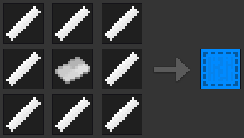

<h1>Minetest blueprints mod</h1>

A Minetest mod that allows items to be copied.

## What is/isn't it?

Blueprints is a way to copy complex node settings with two clicks. One blueprint
can only store one node, if you want to bulk save/load/copy/move nodes, see
[WorldEdit](https://github.com/Uberi/Minetest-WorldEdit).

## Items

Blueprints introduces two types of items: Blank blueprints, and... well...
non-blank blueprints.

Blank blueprint crafting:

Requires:
 - 8 `basic_materials` plastic strips
 - 1 paper sheet

To erase data off a blueprint, provided it isn't already blank, put it in the
crafting grid.

## Usage instructions

Blueprints are relatively intuitive to use. To take a blueprint of something,
simply left-click it while holding a blank blueprint. To apply the blueprint
to other nodes, you can left-click the node. **Do not apply blueprints to chests
or other nodes with items in, you will lose your items.** To place a new node
down with the blueprint applied, just right-click while holding the blueprint.
Note that with pipeworks and mesecons placing a node with a blueprint will not
link up wires/pipes to the node.

## What can/can't be blueprinted?

By default, item metadata (such as node settings) is saved, however, of course,
node inventories aren't. This can be overridden on a per-item basis (for more
information, see the [API] page). Unless overridden by mods, nodes not in the
creative inventory cannot be blueprinted.

Because of the way pipeworks teleportation tubes work, they cannot be
blueprinted.

## Dependencies

Blueprints has no mandatory dependencies, however blueprints will be uncraftable
without `basic_materials` and `default`.

The following dependencies are so blueprint rules can be added onto items for
better compatibility:
 - `mesecons`
   - `mesecons_fpga`
   - `mesecons_microcontroller`
   - `mesecons_luacontroller`
 - `pipeworks`

## License

The whole mod, including textures, are licensed under the [MIT license].

## API

Mod developers can restrict what can/can't be blueprinted with the [API].

[API]:         API.md
[MIT license]: LICENSE.md
